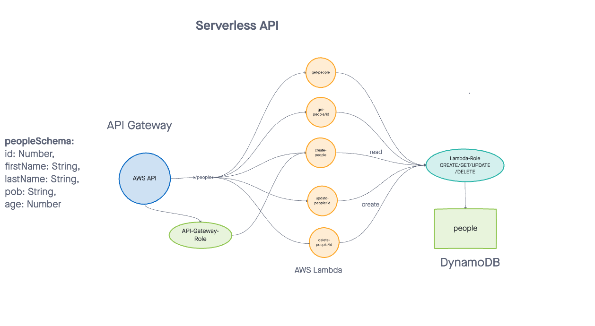

# serverless-api

https://qzy65wfguj.execute-api.us-east-2.amazonaws.com/test/people?id=1

https://qzy65wfguj.execute-api.us-east-2.amazonaws.com/test/people

## Author

Roop Hayer

## Summary of Problem Domain

Create a single resource REST API using a domain model of your choosing, constructed using AWS Cloud Services
## Links to Application Deployment

[Link AWS](https://qzy65wfguj.execute-api.us-east-2.amazonaws.com/test/people)

[PR](https://github.com/RoopHayer/bearer-auth/serverless-api/4)

## Include Embedded UML

## Routes

- HTTP POST

  - Path: /people
    - Returns: returns an object representing one record, by its id (##)

- HTTP GET

  - Path: /people
    - Returns: an array of objects representing the records in the database
    - [Link](https://qzy65wfguj.execute-api.us-east-2.amazonaws.com/test/people)

- HTTP GET

  - Path: /people?id=
    - Returns: returns an object representing one record, by its id (##)
    - [Link](https://qzy65wfguj.execute-api.us-east-2.amazonaws.com/test/people?id=1)

- HTTP PUT

  - Path: /people?id=
    - Returns: String "Item updated!"

- HTTP DELETE

  - Path: /people?id=
    - Returns: String "Successfully deleted an item!"

